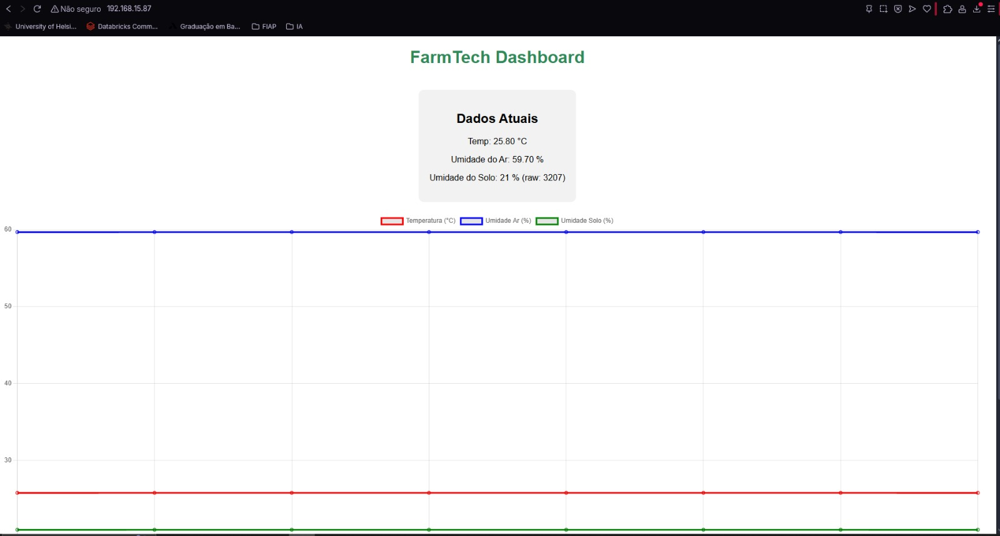

# FIAP - Faculdade de Informática e Administração Paulista

 

# Cap 1 - FarmTech na era da Cloud Computing

|        Grupo             |                   RM                   |
|:------------------------:|:--------------------------------------:|
| **Arthur Luiz Rosado Alves** | RM562061                          |
| **Renan de Oliveira Mendes** | RM563145                          |

Link do vídeo: 

# Entrega1

Análise de uma base de dados com informações de: condições de solo, temperatura, tipo de produto agrícola e rendimento da safra dessa fazenda.
Indetificação de tendências para os rendimentos das plantações, por meio de clusterizações, e tratamento de outliers.
Treinamento e avaliação de cinco modelos preditivos.

- crop_yield.csv -> Base de dados
- Cap1__FarmTech.ipynb - > Notebook python com os processos realizados e modelos treinados.

# Entrega 2:

Acessando a AWS, utilizamos a calculadora de custos para criar uma estimativa de uso de uma máquina Linux simples (EC2).
- 2 CPUs.
- 1 GIB de memória.
- Até 5 Gigabit de rede.
- 50 GB de armazenamento (HD).

- estimativaAWS.pdf -> Estimativa realizada.

Comparamos os valores em duas regiões: São Paulo (BR) X Virgínia do Norte (EUA), para responder:
_"Suponha também que você precisa acessar rapidamente os dados dos sensores e que há restrições legais para armazenamento no exterior. Qual opção você escolheria? Justifique."_

 

 

 

 

 

## Análise e Conclusão

Diante da estimativa que realizamos, a alternativa mais adequada é a utilização da região São Paulo. Embora o custo mensal nesta região seja superior em comparação a Virgínia do Norte, a decisão não pode se basear somente pela parte financeira. Outros dois pontos fundamentais que justificam a escolha: restrições legais e desempenho técnico.

Como existem restrições legais para o armazenamento de dados no exterior, nesse cenário, manter a infraestrutura na região de São Paulo assegura conformidade com legislações como a LGPD e outras normas regulatórias aplicáveis, evitando riscos jurídicos. Além disso, como os sensores responsáveis pela coleta de dados estão localizados no Brasil, hospedar a API e o processamento de Machine Learning no mesmo país garante redução de latência e maior eficiência no acesso as informações em tempo real. Garantindo resposta rápida.

Portanto, mesmo diante do custo adicional estimado de aproximadamente USD 19 por mês, a solução mais apropriada é optar pela região São Paulo (sa-east-1), essa decisão garante conformidade regulatória e eficiência técnica.

O gráfico abaixo mostra a diferença de valores, mas resalta simbolicamente como os benefícios legais e desempebnho técnico podem "amenizar" os custos.
 

# Projeto IR ALÉM
Decidimos realizar o “Ir Além”. Optamos pela primeira opção.
Link: https://youtu.be/VA6OxGdi-YU
 
## Sistema de Coleta e Comunicação de Dados Usando ESP32 Integrado ao Wi-Fi.

Utilizando um ESP32 real com comunicação Wi-Fi e coleta de dados via sensore, desenvolvemos uma solução para a FarmTech Solutions. 
E criamos uma página HTML, usando o ESP32 como servidor HTTP.

### Sensores

Para o desenvolvimento deste projeto da FarmTech Solutions, foram escolhidos dois sensores:

DHT22: responsável por medir temperatura e umidade do ar, fundamentais para o monitoramento climático em ambientes agrícolas.

Capacitive Soil Moisture Sensor v2.0: utilizado para medir a umidade do solo, informação essencial para a tomada de decisão no manejo da irrigação.

Escolhemos esses sensores por se alinharem com soluções e processos de agricultura inteligente, onde o controle de clima e de irrigação são fatores críticos para aumentar a produtividade e reduzir desperdícios de recursos hídricos.

### Implementação

Utilizamos um ESP32 DevKit conectado a uma protoboard de 400 pontos, com jumpers para ligação dos sensores.
O DHT22 foi ligado ao GPIO14, enquanto o sensor de umidade do solo foi conectado ao GPIO34 - entrada analógica.

A comunicação Wi-Fi foi configurada no ESP32, permitindo a integração do dispositivo com a rede local.
O firmware desenvolvido realiza a leitura periódica dos sensores e organiza os dados coletados.

### Armazenamento e Visualização

Criamos uma página web hospedada no próprio ESP32 (HTTP embutido).

Essa página exibe os dados organizados -Temperatura, Umidade do Ar e Umidade do Solo.

Também foi implementado um dashboard interativo, que apresenta gráficos em tempo real dos parâmetros monitorados.
Os valores são atualizados automaticamente no navegador, permitindo acompanhar a evolução dos dados de forma intuitiva.

### Resultado

1.Dois sensores distintos foram integrados e configurados no ESP32.

2.A comunicação Wi-Fi foi estabelecida com sucesso.

3.Os dados coletados foram enviados e exibidos em uma interface web acessível pela rede local.

### O projeto conseguiu representar uma solução real para soluções de monitoramento agrícola inteligente dentro da FarmTech Solutions.
